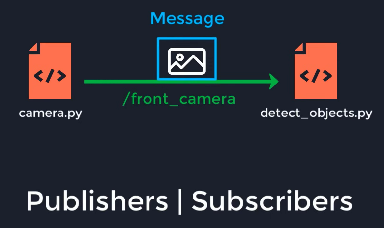

[What Is ROS2? - Framework Overview - YouTube](https://youtu.be/7TVWlADXwRw?si=jbaHITiotzVvnYbl)
[ROS2 Tutorial - ROS2 Humble 2H50 \[Crash Course\] - YouTube](https://youtu.be/Gg25GfA456o?si=kYlAWEfoWlnQYkVv)
[C++ Publisher Subscriber Example](https://docs.ros.org/en/foxy/Tutorials/Beginner-Client-Libraries/Writing-A-Simple-Cpp-Publisher-And-Subscriber.html)
## what is ros2?

- DDS, data distribution service, acts as a pipeline to exchange data between nodes / programs, data sent can be encrypted
- nodes, programs that are executed
**methods of communication**
- ==publisher | subscriber method==

	*/front_camera is a topic here*
	publisher can output data that subscribers can read, unidirectional
- services method
	one program can send an action request, and the other program will send back a response, bidirectional
- actions method
	one program will send an action, the other program will send back status updates, bidirectional
**data collection**
- you can create a "bag file", which will subscribe to multiple publishers and collect data on them, the data can also be played back via the same "bag file"
**more jargon**
- packages act as a container for multiple nodes / programs
- while nodes are sort of like programs, the nodes themselves need to be instantiated within the program itself, its basically an object that you have to make an instance of before using
- packages allow for a sort of "dockerization" of your nodes, as they contain all of the source files as well as any dependencies, this allows for greater ease in collaborating
## applications

as the image above describes, we can have the drone mounted camera publish camera data to the object detection program (the obj_detect will subscribe to the camera)
the output from the object detection can publish to a bag file to look at later (both the annotated images as well as the tensor string output)

## misc

ros2 humble, the version that we are using requires ubuntu 22.04 jammy jellyfish

## creating package

including this here because i will likely need to reinstantiate this package for the actual repository, and i dont want to forget the dependencies
``` bash
ros2 pkg create obj_detect \
    --build-type ament_cmake \
    --dependencies rclcpp sensor_msgs cv_bridge image_transport
```

What each dependency does:

| Dependency        | Purpose                                                            |
| ----------------- | ------------------------------------------------------------------ |
| `rclcpp`          | Write ROS 2 nodes in C++.                                          |
| `sensor_msgs`     | Receive camera images as `sensor_msgs::msg::Image`.                |
| `cv_bridge`       | Convert ROS images into OpenCV `cv::Mat` objects.                  |
| `image_transport` | Subscribe to and publish images using ROS image transport plugins. |

**additionally**, you'll need yolo11.onnx and then opencv, which by default should be version 4.10, *hopefully...*
these aren't really included in the dependencies for the ros packages, because i think they're instead put in the cmake file or something idk